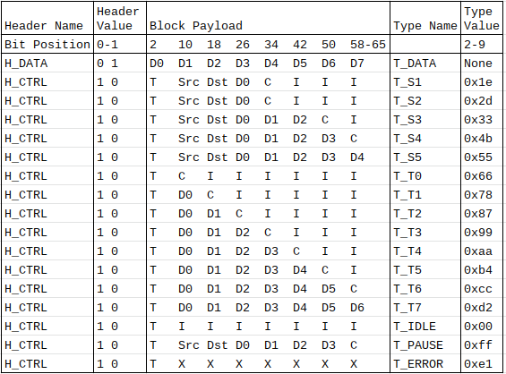
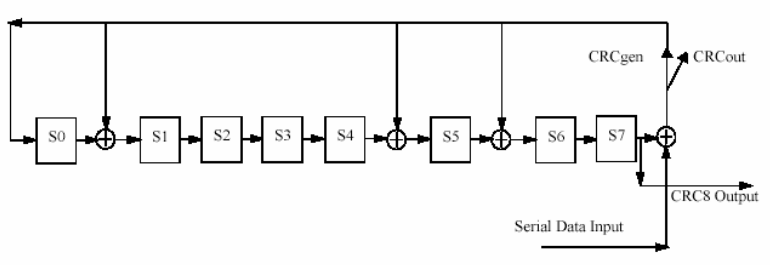
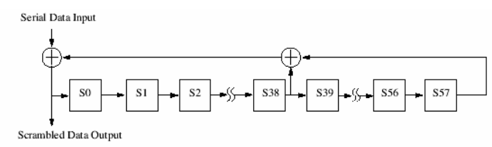
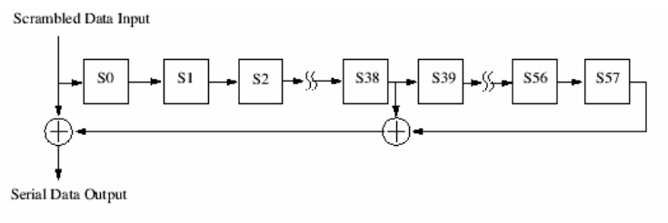
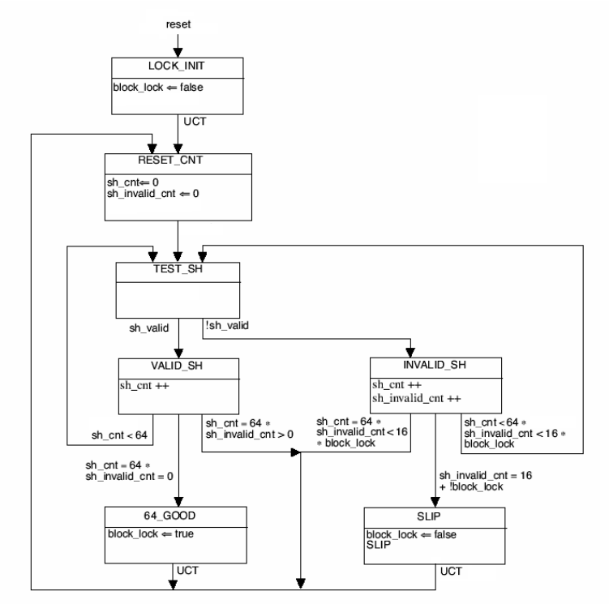
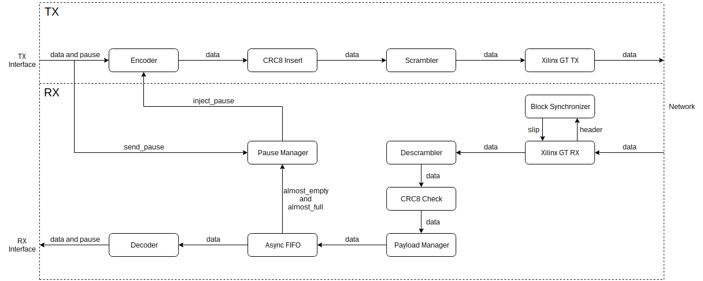

# Aqueduct: A Low Level Protocol for Intra-Rack Communication

## 1. Introduction

Aqueduct is a low level protocol with flow control and error checking without the overhead of Ethernet.

---

## 2. Specification

The Aqueduct protocol builds on sections of the 64b66b encoding PCS and MII detailed in IEEE 802.3 Clause 49 with the added benefit of source and destination signalling, and flow control capabilities within a lower level protocol. This protocol was originally designed to facilitate communication between up to 48 transceivers connected through an Arista 7130 layer one switch.

### 2.1 Terms and Definitions

Payload: 8 bytes of user and control bytes.

Header *or* Sync Header: 2 bit synchronization header.

Transfer: A single 8 byte payload and 2 bit header of a packet.

Packet: Multiple 8 byte payloads and 2 bit headers belonging together.

### 2.2 Encoding Structure

The encoding structure shall have the format shown in Figure 0. The transmitter must send packets in this format and the receiver must receive packets encoded in this format.

Legend:

User Bytes:

- D0-D7 = Data bytes
- Src = Source byte
- Dst = Destination byte

Control Bytes:

- T = Type byte
- C = CRC8 byte
- I = Idle byte = `0x00`
- X = Don't care

Figure 0. Encoding Scheme

Rules:

1. Packet transfers must be one of the above formats.
2. Packets must start with a transfer of type T_S1, T_S2, T_S3, T_S4 or T_S5.
3. Packets must end with a transfer of type T_T0, T_T1, T_T2, T_T3, T_T4, T_T5 or T_T6.
4. Transfer formats must be chosen to include as many Data bytes as possible per transfer.
5. Packets must include one and only one CRC8 byte.
6. Idle (T_IDLE), Pause (T_PAUSE) and Error (T_ERROR) transfers can appear at any time.
7. CRC8 byte is generated as per [Section 2.2.1.](####2.2.1-crc8-insertion-and-checking).
8. Dst = 0x00 broadcasts and sends the packet to all receivers.
9. Src = 0x00 is undefined.
10. A transceiver may send packets to itself (Dst = Src), for example for testing purposes, but this behaviour is undefined.

#### 2.2.1 CRC8 Insertion and Checking

CRC8 parity bits are generated using the following polynomial.

C(x) = 1 + x + x5 +x6 + x8

The CRC8 generated shall produce the same result as the implementation shown in Figure 1. In Figure 1 the 8 delay elements S0, ..., S7, shall be initialized to zero at the start of each received packet. After this all User bytes of the packet are used serially (in transmission order) to compute the CRC8. The generated CRC8 bits shall be placed in its designated CRC8 byte by the transmitter. The receiver shall use the generated CRC8 byte to verify the correctness of the packet and set the Type byte of the last transfer to T_ERROR when the CRC8 does not match.

Figure 1. CRC8 Generator

### 2.3 Scrambling

All transfers are scrambled by the transmitter and descrambled by the receiver with self-synchronizing scramblers and descramblers. The scrambler and descrambler shall implement the following polynomial.

G(x) = 1 + x39 + x58

The scrambler shall produce the same result as the implementation shown in Figure 2 and the descrambler shall produce the same result as the implementation shown in Figure 3. The value for the initial state of the scrambler and descrambler should be alternating `0`'s and `1`'s starting with either bit. The scrambler and descrambler are run continuously on all payload bits. The header bits bypass the scrambler and descrambler.

Figure 2. Scrambler

Figure 3. Descrambler

### 2.4 Receiver Data Alignment

Data alignment is achieved by the receiver using the synchronization header. Valid header values `01` and `10` allow invalid alignments to be identified and corrected. Lock is obtained as specified in the block lock state machine shown in Figure 4. All transfers are invalid until alignment is achieved.

Symbols:

- reset: reset signal
- block_lock: alignment achieved signal
- sh_cnt: sync headers seen counter
- sh_invalid_cnt: invalid sync headers seen counter
- sh_valid: current sync header is valid
- SLIP: slip signal to transition to next alignment
- UCT: unconditional transition

Figure 4. Synchronization Block State Machine

### 2.5 Flow control

Flow control shall be achieved with the use of Pause (T_PAUSE) packets. An overwhelmed receiver shall signal for the transmitter to send a Pause packet (D0-D3 != `0x00000000`) to Dst = `0x00` (broadcast). Once the receiver recovers it shall signal for the transmitter to send an Unpause packet (D0-D3 = `0x00000000`) to Dst = `0x00` (broadcast). Receivers that receive the Pause packet should stop sending packets to the receiver with address Src until an Unpause packet is received with address Src. A receiver receiving Pause and Unpause packets with Src equal to its own is undefined behaviour.

---

## 3. Example Implementation

An example implementation with modified AXI4-Stream as the user interface. This implementation assumes transceivers are not shared between multiple processes with different Src Addresses. A high level block diagram is presented in Figure 5.

Figure 5. High Level Block Diagram

### 3.1 TX

#### 3.1.1 TX Interface

The user interface for TX consists of a modified AXI4-Stream interface with 64-bit TDATA, 8-bit TKEEP, 8-bit TUSER, 8-bit TDEST, 1-bit TLAST, 1-bit TVALID and 1-bit TREADY as well as `s_pause` and `s_send_pause` for flow control purposes. Clock and reset are provided by the transceiver.

Port | Width | Direction | Clock | Description
-----|------:|:---------:|-------|------------
tx_usrclk2_out | [0:0] | out | tx_usrclk2 | User clock from transceiver.
tx_reset_out | [0:0] | out | tx_usrclk2 | Reset from transceiver.
s_axis_tdata | [63:0] | in | tx_usrclk2 | AXI4-Stream TDATA. Maps to payload data bytes.
s_axis_tkeep | [7:0] | in | tx_usrclk2 | AXI4-Stream TKEEP. Used to determine payload type.
s_axis_tuser | [7:0] | in | tx_usrclk2 | AXI4-Stream TUSER. Maps to Src byte. Should be held steady after reset because of the Pause injection implementation.
s_axis_tdest | [7:0] | in | tx_usrclk2 | AXI4-Stream TDEST. Maps to Dst byte.
s_axis_tlast | [0:0] | in | tx_usrclk2 | AXI4-Stream TLAST. Used to determine payload type.
s_axis_tvalid | [0:0] | in | tx_usrclk2 | AXI4-Stream TVALID. Used to signal valid.
s_axis_tready | [0:0] | out | tx_usrclk2 | AXI4-Stream TREADY. Used to signal ready.
s_pause | [0:0] | in | tx_usrclk2 | Pauses all transmitter activity when asserted. Can be used to implement pausing. Tie to `0` if pausing is implemented manually.
s_send_pause | [0:0] | in | tx_usrclk2 | Send Pause and Unpause Packets. A Pause packet is generated on the positive edge of `s_send_pause` and an Unpause packet is generated on the negative edge of `s_send_pause`. TUSER is used as the Src byte for the Pause and Unpause packets.

#### 3.1.2 Encoder

The [encoder](src/verilog/payload_encoder.v) takes the modified AXI4-Stream interface and generates packets in the format described in [Section 2.2](##2.2-encoding-structure). All user-facing inputs and outputs are buffered. When TREADY goes low, data held in the user buffers are stalled and the one cycle of data that is potentially valid while TREADY propogates through the buffer is clocked into a separate buffer. When TVALID goes high, the user buffer is filled with the data held in the separate buffer before resuming normal operation. The CRC8 byte is not generated by the encoder but a byte of space is set to `0x00` where the CRC8 will go and the CRC8 insertion block will fill it in with the correct CRC8 byte. The constructed payload and header are then sent to the CRC8 insertion block. The encoder also takes inputs `inject_pause_in` and `pause_in`. The signal `inject_pause_in` is generated from the user `s_send_pause` and another internal pause signal. The signal `pause_in` maps directly to `s_pause`. Asserting `pause_in` causes the encoder to set TREADY low and continually send Idle transfers until `pause_in` is deasserted. Asserting `inject_pause_in` causes the encoder to set TREADY low for one cycle while it sends a single Pause packet with D0-D3 = `0xfffffffff`. Deasserting `inject_pause_in` causes the encoder to set TREADY low for one cycle while it sends a single Pause packet with D0-D3 = `0x00000000`. When both of these signals trigger at the same time, precedence is given to servicing `inject_pause_in`, and then `pause_in`.

#### 3.1.3 CRC8 Insertion

The [CRC8 insertion block](src/verilog/crc8_insert.v) generates a CRC8 byte in the method described in [Section 2.2.1](###2.2.1-crc8-insertion-and-checking). The CRC8 generation is unimplemented in the current design and passes through all payloads and headers directly to the scrambler. If it were to be implemented, CRC8 generation should be implemented with an 8-bit addressed lookup table which holds precomputed CRC8 results in order to generate a CRC8 byte for up to 64 bits of data per cycle. A description of this technique can be found in [Section 4](#4.-further-reading) at the link "CRC32 Byte by Byte". The internal state of the CRC8 generator should be reset to `0x00` at the start of every packet and the header and type byte should be used to determine which bytes to run through the CRC8 generator. The resulting CRC8 byte should then be written into the last transfer of the packet in the appropriate location left by the encoder. The completed payload and header should then be sent to the scrambler.

#### 3.1.4 Scrambler

The [scrambler](src/hls/scrambler64.cpp) scrambles all payload bits in the method described in [Section 2.3](###2.3-scrambling). The scrambler is implemented as a parallel 64-bit combinational scrambler that registers the internal state every cycle. The parallelism is implemented using the Vivado HLS unroll pragma. The header is unchanged. The header and scrambled payload are then sent to the [Xilinx GT TX interface](src/gt/gt.md) and sent through the transceiver.

### 3.2 RX

#### 3.2.1 Block Synchronizer

The [block synchorizer](src/hls/block_sync.cpp) uses the received header from the [Xilinx GT RX interface](src/gt/gt.md) to determine data alignment. The implementation is that of [Section 2.4](###2.4-receiver-data-alignment). The slip signal is sent to the Xilinx GT to transition to the next possible alignment.

#### 3.2.2 Descrambler

The [descrambler](src/hls/scrambler64.cpp) descrambles received payloads in the method describled in [Section 2.3](###2.3-scrambling). The descrambler is implemented as a parallel 64-bit combinational descrambler that registers the internal state every cycle. The parallelism is implemented using the Vivado HLS unroll pragma. The header is unchanged. The header and descrambled payload are then sent to the CRC8 checking block.

#### 3.2.3 CRC8 Checking

The [CRC8 checking block](src/verilog/crc8_check.v) generates a CRC8 byte in the method described in [Section 2.2.1](###2.2.1-crc8-insertion-and-checking). The CRC8 checking is unimplemented in the current design and passes through all payloads and headers directly to the payload manager. If it were to be implemented, CRC8 generation should be implemented with an 8-bit addressed lookup table which holds precomputed CRC8 results in order to generate a CRC8 byte for up to 64 bits of data per cycle. A description of this technique can be found in [Section 4](#4.-further-reading) at the link "CRC32 Byte by Byte". The internal state of the CRC8 generator should be reset to `0x00` at the start of every packet and the header and Type byte should be used to determine which bytes to run through the CRC8 generator. The resulting CRC8 byte should then be compared with the existing CRC8 byte generated by the transmitter. If the bytes are not the same, the type of the last transfer should be set to Error. The payload and header should then be sent to the payload manager.

#### 3.2.4 Payload Manager

The [payload manager](src/verilog/payload_manager.v) checks incoming payloads and drops all Idle transfers. It does this by outputting an unbuffered valid signal and deasserting it every time there is an Idle transfer. The payload, header and valid signals are sent to the asynchronous FIFO.

#### 3.2.5 Asynchronous FIFO

The asynchronous FIFO is implemented using the Xilinx Generic FIFO IP and buffers all payload and header bits and allows the data to cross into the tx_usrclk2 domain from the rx_usrclk2 domain. The FIFO is a generic asynchronous FIFO with `full`, `empty`, and `prog_full` warning signals. The `prog_full` signal is used to control pausing. The FIFO depth is set to 512 with `prog_full` set to 16. An `almost_full` and an `almost_empty` is constructed from `prog_full`. The signal is used directly as `almost_full` (even though the FIFO has 512 depth and is no where near full) and the same signal is delayed 16 cycles using a shift register to produce `almost_empty`. The `almost_full` and `almost_empty` signals are sent to the pause manager to generate the correct pause signal to send to the encoder as `inject_pause_in`. This implementation will not work in every case but avoids synchronization problems and is simple. The `full` signal is unused but can be used for error reporting. The `empty` signal is inverted and sent to the decoder as `valid_in`. All signals are synchronized as necessary. The payload and header are used by the decoder.

#### 3.2.6 Pause Manager

The [pause manager](src/verilog/pause_manager.v) constructs a single pause inject signal from multiple pause and unpause signals or pause inject signals or both. When the positive edge of a pause signal is seen this generates a positive edge on a pause inject signal. When the positive edge of an unpause signal is seen this generates a negative edge on a pause inject signal. When both are asserted in the same cycle the pause inject signal remains unchanged. All of the generated and input pause inject signals are OR'd together and the result is sent to the encoder as `inject_pause_in`.

#### 3.2.7 Decoder

The [decoder](src/verilog/payload_decoder.v) takes the payload and header in the format described in [Section 2.2](##2.2-encoding-structure) and generates a modified AXI4-Stream interface. All user-facing inputs and outputs are buffered. TREADY is omitted from the AXI4-Stream interface. When the decoder finds an Error or any invalid transfers in a packet, it sets TVALID low and sets `m_error` high for the remainder of the packet. The first valid transfer following the deassertion of `m_error` is the first transfer of the next packet. When the decoder finds a Pause packet it sets TVALID low and sets `m_error` low. It then asserts or deasserts `pause_out` which is sent to the RX interface as `m_pause` depending on D0-D3; if D0-D3 != `0x00000000` the decoder asserts `pause_out`. If D0-D3 = `0x00000000` the decoder deasserts `pause_out`. The decoder also outputs the Src of the Pause packet on `pause_src_out` which is sent to the RX interface as `m_pause_src`. The decoder should not find any Idle packets as they should have been removed by the payload manager but in the case that it does, the decoder sets TVALID low and sets `m_error` low.

#### 3.2.8 RX Interface

The user interface for RX consists of an AXI4-Stream interface with 64-bit TDATA, 8-bit TKEEP, 8-bit TUSER, 8-bit TDEST, 1-bit TLAST and 1-bit TVALID. As TREADY is omitted the RX cannot be backpressured. The RX also provides `m_error` to signal when it encounters invalid transfers. Clock and reset are provided by the transceiver.

Port | Width | Direction | Clock | Description
-----|------:|:---------:|-------|------------
tx_usrclk2_out | [0:0] | out | tx_usrclk2 | User clock from transceiver.
tx_reset_out | [0:0] | out | tx_usrclk2 | Reset from transceiver.
m_axis_tdata | [63:0] | out | tx_usrclk2 | AXI4-Stream TDATA. Generated from payload.
m_axis_tkeep | [7:0] | out | tx_usrclk2 | AXI4-Stream TKEEP. Generated from payload type.
m_axis_tuser | [7:0] | out | tx_usrclk2 | AXI4-Stream TUSER. Generated from Src byte.
m_axis_tdest | [7:0] | out | tx_usrclk2 | AXI4-Stream TDEST. Generated from Dst byte.
m_axis_tlast | [0:0] | out | tx_usrclk2 | AXI4-Stream TLAST. generated from payload type.
m_axis_tvalid | [0:0] | out | tx_usrclk2 | AXI4-Stream TVALID. Used to signal valid.
m_error | [0:0] | out | tx_usrclk2 | Used to signal transfer error. The first valid transfer after an error transfer is the first transfer of a new packet.
m_pause | [0:0] | out | tx_usrclk2 | Signals whether a receiver on the network has requested a pause.
m_unpause | [0:0] | out | tx_usrclk2 | Signals whether a receiver on the network has requested an unpause.
m_pause_src | [7:0] | out |tx_usrclk2 | Signals which receiver on the network has requested the pause or unpause.

---

## 4. Further Reading

Description | Link
------------|-----
Vivado HLS User Guide | <https://www.xilinx.com/support/documentation/sw_manuals/xilinx2018_3/ug902-vivado-high-level-synthesis.pdf>
Xilinx GTY User Guide | <https://www.xilinx.com/support/documentation/user_guides/ug578-ultrascale-gty-transceivers.pdf>
Xilinx Transceiver Wizard Product Guide | <https://www.xilinx.com/support/documentation/ip_documentation/gtwizard_ultrascale/v1_7/pg182-gtwizard-ultrascale.pdf>
IEEE 802.3 Clause 49 64b66b Encoding | <http://www.ieee802.org/3/ap/public/sep05/szczepanek_02_0905.pdf>
AXI4-Stream Specification | <http://www.mrc.uidaho.edu/mrc/people/jff/EO_440/Handouts/AMBA%20Protocols/AXI-Stream/IHI0051A_amba4_axi4_stream_v1_0_protocol_spec.pdf>
Asynchronous FIFO | <https://www.xilinx.com/support/documentation/ip_documentation/fifo_generator/v13_2/pg057-fifo-generator.pdf>
CRC32 Byte by Byte | <http://www.sunshine2k.de/articles/coding/crc/understanding_crc.html#ch44>

---
