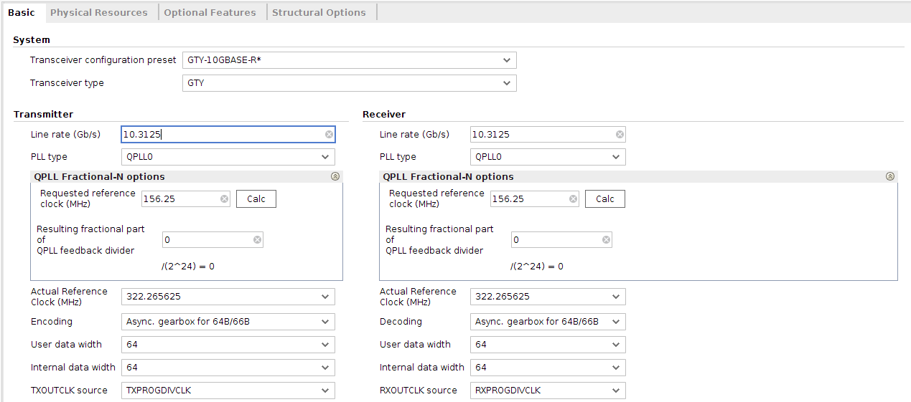
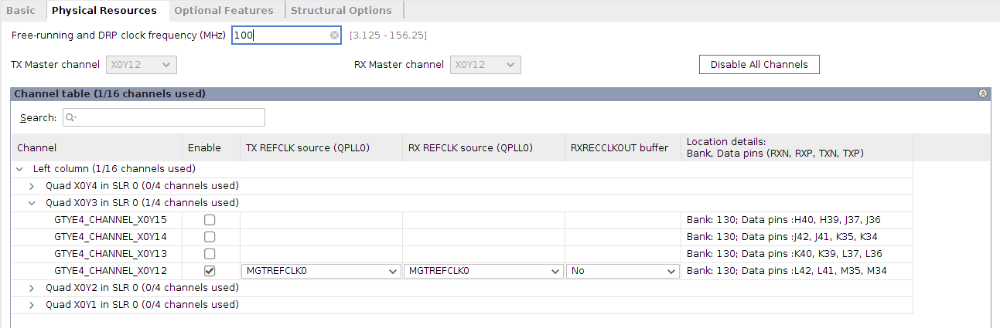

# UltraScale FPGAs Transceivers Wizard Setup

## IP Configuration

The IP requires some modifications from default configuration. Modify fields to match configuration shown in Figures 0 and 1. Any fields not shown do not need modification from default configuration.

Figure 0. Basic Settings

Figure 1. Physical Resources Settings

## Example Design Generation

When IP configuration is finished, right click the generated IP and select "Open Example Design...".

## Top Level Modifications

The top level file of the example design requires modification for general use. for legal reasons the top level source cannot be included in this repository. Below are the high level descriptions on the modifications necessary:

1. Add tx and rx usrclk2 outputs and directly connect to transceiver.
2. Synchronize input reset to tx and rx usrclk2 and add as tx and rx reset outputs.
3. Add tx and rx data inputs and connect directly to transceiver.
4. Add tx and rx header inputs and connect directly to transceiver.
5. Add block sync signal slip as an input and connect directly to transceiver.
6. Add block sync signal block lock as an input and replace existing data valid generation with block lock.

For those who are a part of PC Group more information can be found on the PC Group DokuWiki under page `gtwiz64b66b`.
